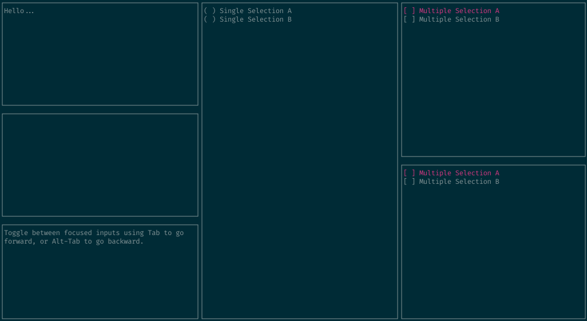

# tui — Go Terminal UI Framework

> **EXPERIMENTAL** This framework is in a very early stage of active development. There are no guarantees of stability or backwards compatibility whatsoever.

tui is based on the excellent https://github.com/jroimartin/gocui which is in turn based on the also excellent https://github.com/nsf/termbox-go

The goal of tui is to be easy to use and to get started with. As development continues, I hope to make many useful and simple to use widgets/components available.

## Preview


Run the above example yourself:
```
go run ./example/main.go
```
